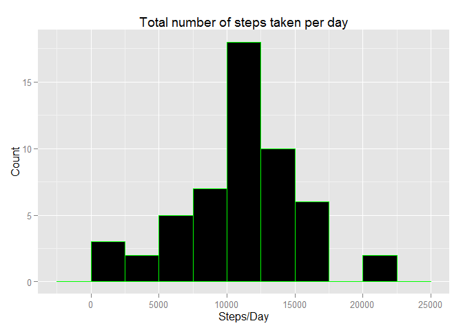
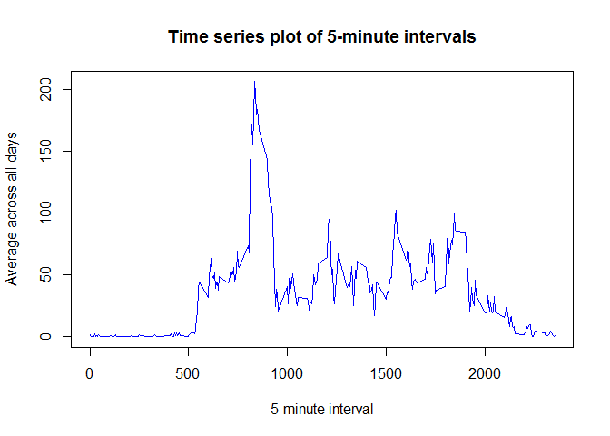

# Reproducible Research: Peer Assessment 1
ckwong338  
Monday, October 20, 2014  

## Loading and preprocessing the data


```r
activity <- read.csv("activity.csv")
activity$date <- as.Date(activity$date, "%Y-%m-%d")
```

## What is mean total number of steps taken per day?


```r
aggregated <- aggregate(steps ~ date, activity, sum)
```
 

Mean of total number of steps taken per day:

```r
mean(aggregated$steps)
```

```
## [1] 10766
```
Median of total number of steps taken per day:

```r
median(aggregated$steps)
```

```
## [1] 10765
```
## What is the average daily activity pattern?

Apply mean across the 5-minute intervals:

```r
ts <- tapply(activity$steps, activity$interval, mean, na.rm = TRUE)
```
 

Which 5-minute interval, on average across all the days in the dataset, contains the maximum number of steps?

```r
names(ts[ts==max(ts)])
```

```
## [1] "835"
```

## Inputing missing values
Total number of missing values in the dataset:

```r
sum(is.na(activity$steps))
```

```
## [1] 2304
```
Fill in all missing values with mean for the 5-minute interval, and create new dataset:

```r
averagePerInterval <- aggregate(steps ~ interval, activity, mean)
newActivity <- activity
for (i in 1:nrow(newActivity)) {
    if (is.na(newActivity[i,]$steps)) {
        newActivity[i,]$steps<-averagePerInterval[averagePerInterval$interval==newActivity[i,]$interval,]$steps
    }
}
```

```r
aggregated2 <- aggregate(steps ~ date, newActivity, sum)
```
 

Mean of total number of steps taken per day:

```r
mean(aggregated2$steps)
```

```
## [1] 10766
```
Median of total number of steps taken per day:

```r
median(aggregated2$steps)
```

```
## [1] 10766
```
There is not much differences at all in the mean and median of the total number of steps taken per day.

## Are there differences in activity patterns between weekdays and weekends?

Create new factor variable for dataset, indicating weekday or weekend:

```r
dayFactor <- vector()
for (i in 1:nrow(newActivity)) {
    if (weekdays(newActivity[i,]$date) == "Saturday") {
        dayFactor[i] <- "Weekend"
    } else if (weekdays(newActivity[i,]$date) == "Sunday") {
        dayFactor[i] <- "Weekend"
    } else {
        dayFactor[i] <- "Weekday"
    }
}
newActivity$dayFactor <- factor(dayFactor)
aggregated3 <- aggregate(steps ~ interval + dayFactor, data = newActivity, mean)
```
 

Yes, there are differences in activity patterns between weekdays and weekends.
